基于Springboot的共享单车管理系统
=

### 完整代码获取地址：从戎源码网 ([https://armycodes.com/](https://armycodes.com/))
### 作者微信：19941326836  QQ：952045282 
### 承接计算机毕业设计、Java毕业设计、Python毕业设计、深度学习、机器学习
### 选题+开题报告+任务书+程序定制+安装调试+论文+答辩ppt 一条龙服务
### 所有选题地址https://github.com/nature924/allProject

一、项目介绍
---

基于SpringBoot框架的共享单车管理系统，系统角色为监管部门、运营人员、调度人员、普通用户，主要功能如下

监管部门：
基本操作：登录、获取验证码
菜单导航：获取左侧菜单（基于用户权限）
车辆管理：获取车辆列表、分页筛选（按编号模糊）、新增车辆、修改车辆、删除车辆
区域管理：新增区域、查看区域列表
调度管理：获取调度列表、添加调度、修改调度、删除调度
故障管理：获取故障列表（含报修用户与车辆信息）
申诉管理：获取申诉列表（筛选内容、状态、分页）、审批申诉
数据统计：车辆区域分布饼图、车辆数量区域柱状图

运营人员：
基本操作：登录、获取验证码
菜单导航：获取左侧菜单（基于用户权限）
车辆管理：获取车辆列表、分页筛选（按编号模糊）、新增车辆、修改车辆、删除车辆
区域管理：新增区域、查看区域列表
调度管理：获取调度列表、添加调度、修改调度、删除调度
故障管理：获取故障列表（含报修用户与车辆信息）
申诉管理：获取申诉列表（筛选内容、状态、分页）、审批申诉
数据统计：车辆区域分布饼图、车辆数量区域柱状图

调度人员：
基本操作：登录、获取验证码
菜单导航：获取左侧菜单（基于用户权限）
车辆管理：获取车辆列表、分页筛选（按编号模糊）
区域管理：查看区域列表
调度管理：获取调度列表、添加调度、修改调度、删除调度
故障管理：获取故障列表（含报修用户与车辆信息）
申诉管理：获取申诉列表（筛选内容、状态、分页）
数据统计：车辆区域分布饼图、车辆数量区域柱状图

普通用户：
基本操作：登录、获取验证码
菜单导航：获取左侧菜单（基于用户权限）
车辆浏览：获取单车列表
区域查看：查看区域列表
违规记录：获取本人违规记录列表（筛选原因、分页）
申诉管理：获取本人申诉列表（筛选内容、状态、分页）、提交申诉
故障报修：提交故障报修
行程记录：获取本人骑行记录列表
个人统计：查看本人骑行时长折线图

二、项目技术
---
- 编程语言：Java
- 数据库：MySQL
- 项目管理工具：Maven
- 前端技术：VUE、HTML、Jquery、Bootstrap
- 后端技术：Spring、SpringMVC、MyBatis

三、运行环境
---
- 操作系统：Windows、macOS都可以
- JDK版本：JDK1.8以上都可以
- 开发工具：IDEA、Ecplise、Myecplise都可以
- 数据库: MySQL5.7以上都可以
- Tomcat：任意版本都可以
- Maven：任意版本都可以

四、运行截图
---

### 程序截图：
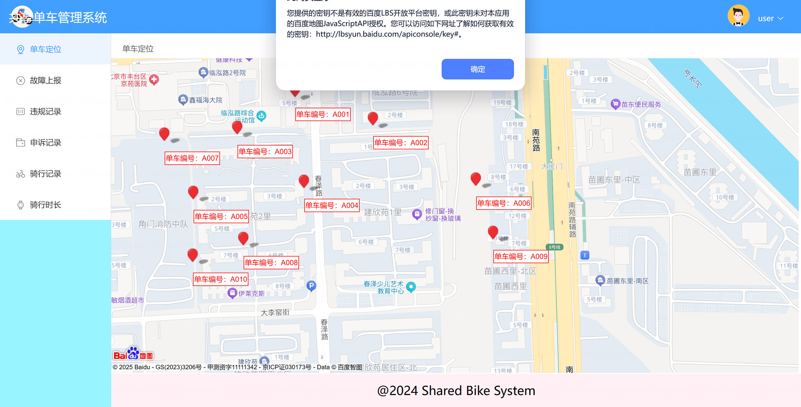
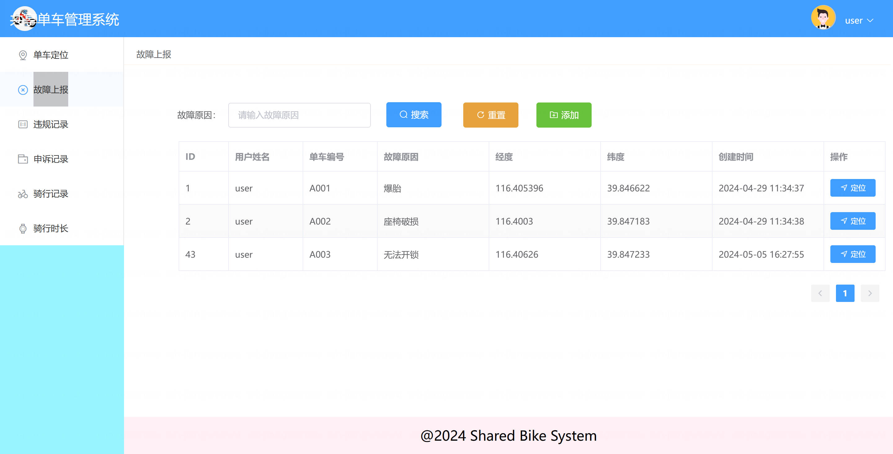
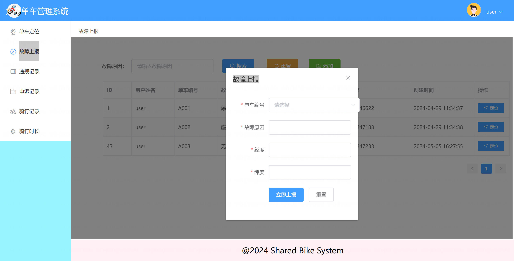
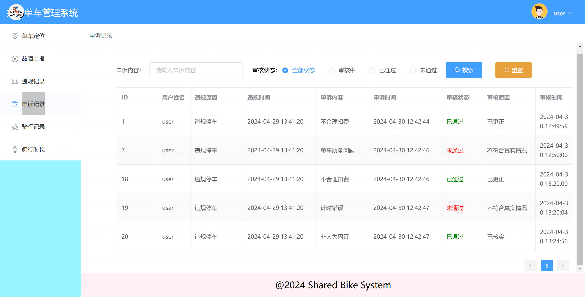
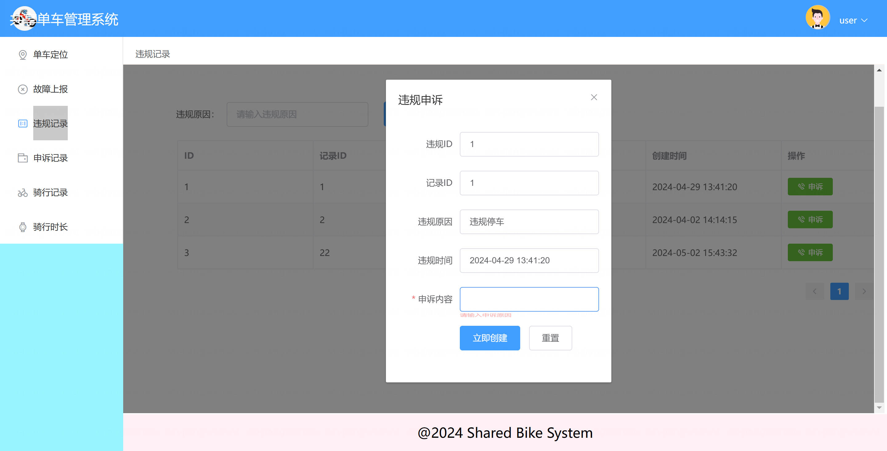
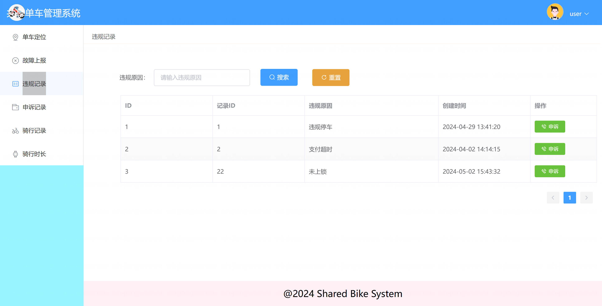
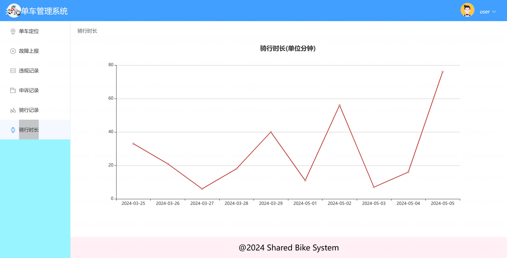
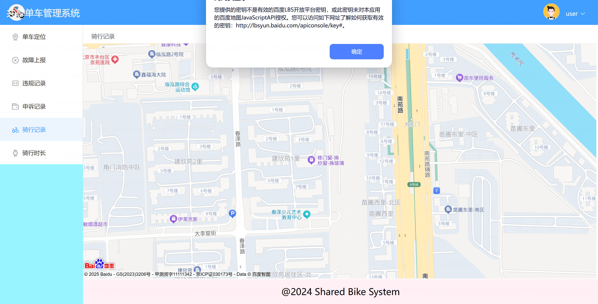
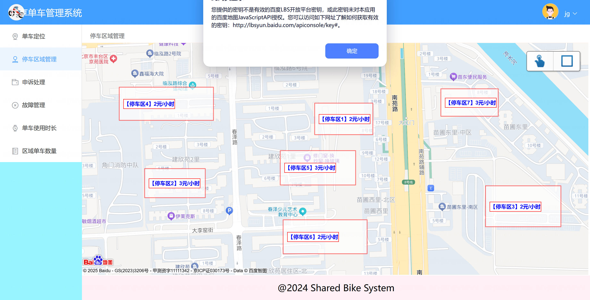
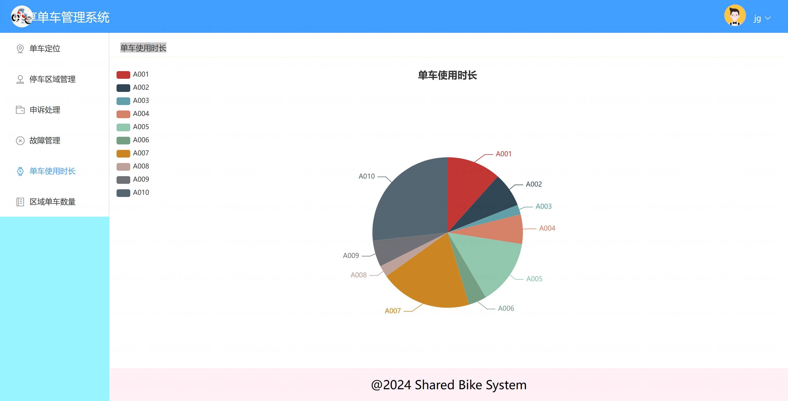
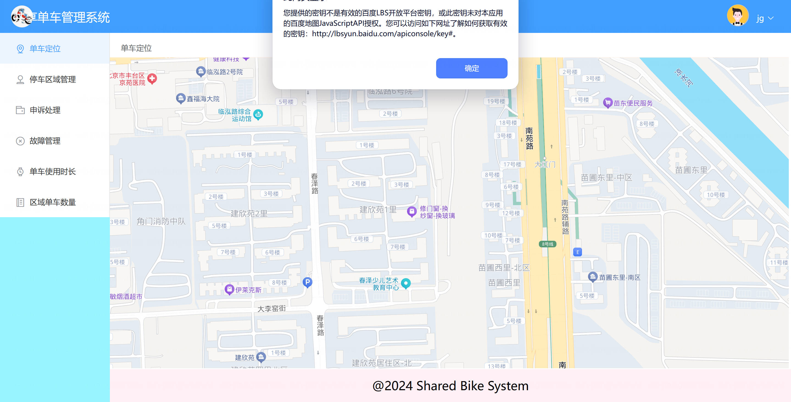
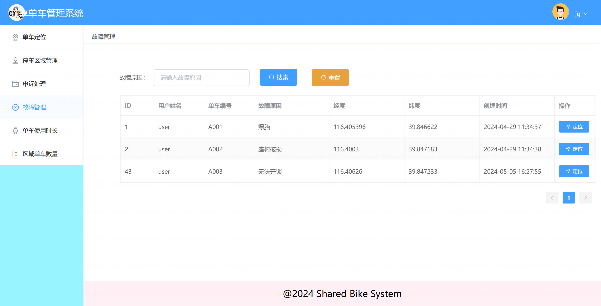

